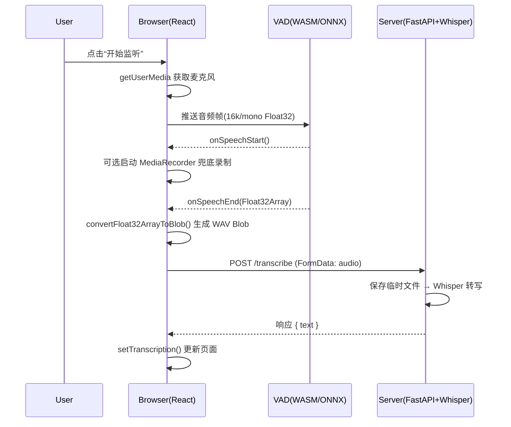

# 语音转文字应用 (STT Demo)

这是一个使用React和Python FastAPI构建的语音转文字应用，利用OpenAI的Whisper模型进行语音识别。

## 项目结构

```
stt-demo/
├── client/             # React前端
│   ├── package.json
│   └── src/
│       ├── App.js
│       ├── App.css
│       ├── index.js
│       ├── index.css
│       ├── reportWebVitals.js
│       └── components/
│           ├── ASRTest.js
│           └── ASRTest.css
└── server/             # Python FastAPI后端
    ├── main.py
    └── requirements.txt
```

## 安装与运行

### 环境
   ```bash
brew upgrade ffmpeg
   ```

### 前端 (Client)

1. 进入client目录：
   ```bash
   cd client
   ```

2. 安装依赖：
   ```bash
   npm install
   ```

3. 启动开发服务器：
   ```bash
   npm start
   ```
   前端将在 http://localhost:3000 运行

### 后端 (Server)

1. 进入server目录：
   ```bash
   cd server
   ```

2. 创建并激活虚拟环境（推荐）：
   ```bash
   python3 -m venv venv
   # Windows
   venv\Scripts\activate
   # macOS/Linux
   source venv/bin/activate
   ```

3. 安装依赖：
   ```bash
   pip install -r requirements.txt
   ```

4. 启动服务器：
   ```bash
   python main.py
   ```
   后端将在 http://localhost:8000 运行

## 使用方法

1. 打开浏览器访问 http://localhost:3000
2. 点击"开始录制"按钮并允许麦克风访问权限
3. 说话后点击"停止录制"
4. 点击"转换"按钮将录音发送到服务器进行语音识别
5. 识别结果将显示在页面上

## 注意事项

- 确保后端服务器正在运行，否则转换功能将无法工作
- 首次加载Whisper模型可能需要一些时间
- 默认使用的是Whisper的"base"模型，可以在server/main.py中修改为其他模型大小

## 技术栈

- 前端：React, RecordRTC
- 后端：FastAPI, Whisper, Uvicorn

---

## 原理与流程（含 VAD 检测）

本项目前端通过浏览器实时检测“何时在说话”（VAD），在语音段结束时将该段音频发送到后端，由 Whisper 进行转写。

### 1. 前端 VAD 检测与音频处理

- __VAD 库与加载方式__：在 `client/public/index.html` 通过 CDN 引入
  - `onnxruntime-web@1.14.0`：提供 WASM 推理能力
  - `@ricky0123/vad-web@0.0.22`：封装麦克风→模型推理→回调事件
  库加载后在全局暴露 `window.vad`，组件 `client/src/components/ASRTest.js` 里通过 `window.vad.MicVAD` 使用。

- __音频采集__：`navigator.mediaDevices.getUserMedia({ audio: true })` 获取麦克风流（需 HTTPS 或 localhost）。

- __VAD 推理原理（简述）__：
  - WebAudio 的 `AudioWorklet` 读取 16kHz 单声道音频帧（Float32Array）。
  - 在 `WebWorker`/WASM 线程中，`onnxruntime-web` 加载 VAD 的 `.onnx` 模型并进行帧级推理，输出“语音活动概率”。
  - 通过阈值与滞后来判定 `onSpeechStart` 与 `onSpeechEnd(audio)`，并在结束时返回该段语音的浮点 PCM 数组 `Float32Array`（即“VAD 数据”）。

- __VAD 在代码中的使用__：见 `ASRTest.js`
  - 初始化：检测 `window.vad && window.vad.MicVAD`（`useEffect` 里的 `initVAD()`）。
  - 开始监听：`MicVAD.new({...}).then(vad => vad.start())`。
  - 回调：
    - `onSpeechStart`：检测到说话，前端同步启动 `MediaRecorder` 作为兜底录制。
    - `onSpeechEnd(audio)`：收到一段 `Float32Array`，调用 `convertFloat32ArrayToBlob(audio)`。

- __Float32Array → WAV Blob__：见 `ASRTest.convertFloat32ArrayToBlob()`
  - 以 16kHz、单声道写入标准 WAV 头，然后把采样数据（-1~1）量化为 16-bit PCM。
  - 生成 `Blob(type='audio/wav')`，用于上传/播放/保存。

### 2. 前后端接口与交互

- __前端上传__：见 `ASRTest.uploadAudio()`
  - 使用 `FormData`：`formData.append('audio', audioBlob, 'recording.webm')` 或 `audio/wav`。
  - 通过代理 `client/package.json` 的 `"proxy": "http://localhost:8000"` 发送到 `/transcribe`。

- __后端接口__：见 `server/main.py`
  - `POST /transcribe`：接收 `UploadFile`，保存到 `temp/temp_audio.webm`。
  - 调用 Whisper：`result = model.transcribe(temp_file_path)`，返回 `{"text": ...}`。
  - 后端在启动时加载一次 Whisper `base` 模型。

- __请求流概览__：
  1) 浏览器获取麦克风 → VAD 检测语音段 → 语音结束得到 `Float32Array`。
  2) 前端将音频转换为 WAV `Blob`，放入 `FormData` 发送到 `/transcribe`。
  3) 后端保存音频并用 Whisper 转写，返回 JSON 文本结果。
  4) 前端将返回文本拼接显示（见 `ASRTest` 的 `setTranscription`）。

### 流程图（从采集到显示）



### 3. 运行要求与注意事项

- __浏览器与权限__：需 HTTPS 或 `http://localhost` 才能访问麦克风。
- __CDN 可用性__：若担心 CDN 失败，可在 `public/` 放置本地备份文件并在 `index.html` 增加 `onerror` 兜底。
- __性能与延迟__：VAD 与 Whisper 都会消耗资源；VAD 在 WASM 中执行，不阻塞 UI，转写在后端进行。
- __音频格式__：示例以 16k 单声道、16-bit PCM 生成 WAV，后端 Whisper 能正确解析。

### 4. 关键文件引用

- 前端入口与 VAD 脚本加载：`client/public/index.html`
- VAD 检测与音频上传逻辑：`client/src/components/ASRTest.js`
- 后端转写服务：`server/main.py`


### 5. VAD 在客户端 vs 服务端（方案对比）

- __客户端 VAD（Browser）__
  - 优点：
    - 减少带宽：只在检测到语音段时上传音频；静音不上传。
    - 低时延反馈：立即在客户端得到“开始/结束”事件，能驱动 UI 和本地录制。
    - 隐私更好：可只上传说话片段或本地先做裁剪/变换。
    - 易横向扩展：推理在每个用户浏览器内完成，服务端压力小。
  - 缺点：
    - 需在浏览器加载 `.wasm/.onnx` 等资源，首包略大，偶发 CDN/路径问题。
    - 端上算力受限，老设备性能可能波动。
  - 适用：Web 应用、希望减轻后端负载、追求及时交互与成本可控。

- __服务端 VAD（Server）__
  - 形态：前端持续推流/定时上传音频片段到后端，由后端做 VAD（如 WebRTC VAD等）。
  - 优点：
    - 统一模型与环境：可用更重的模型与更稳定的算力，便于统一优化与监控。
    - 对终端设备无要求：前端只采集与上传，不跑推理。
  - 缺点：
    - 带宽与成本：静音时也可能需要推流，占带宽与服务器资源。
    - 端到端时延更高：网络往返 + 队列处理。
    - 可扩展性压力在服务端：并发多时需扩容。
  - 适用：对一致性、可控性、可观测性要求很高的后台系统或多端入口统一接入。

- __折中方案__
  - 客端先做轻量预筛（RMS/能量阈值/轻量 VAD），服务端做二次精判与转写。
  - 在弱网或高安全场景，可切换到“本地缓存 + 批量上传 + 服务端 VAD”。

